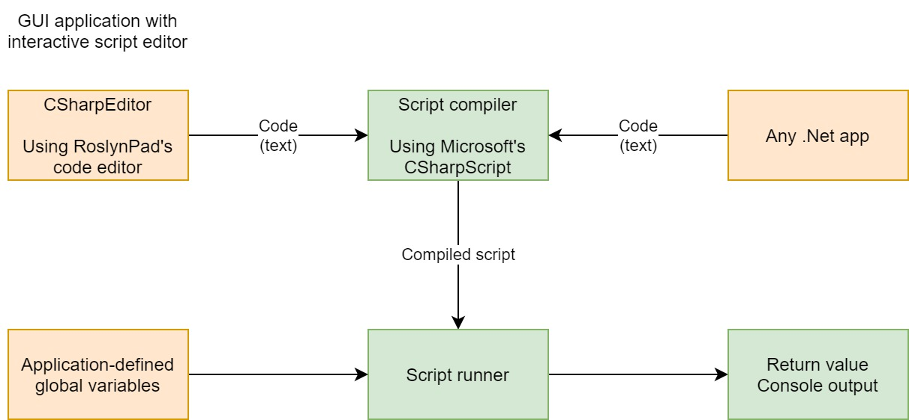

# CDS.CSharpScripting
1. C# code editor
2. Script compilation and execution

The code editor is a simplified wrapper around the amazing [RoslynPad C# WPF](https://github.com/aelij/RoslynPad) code editor, via the RoslynPad.Roslyn.Windows NuGet pacakge.

Compilation and execution is built around Microsoft's open-source .Net compiler platform
known as [Roslyn](https://en.wikipedia.org/wiki/Roslyn_(compiler)), available from 
the Microsoft.CSharp package on NuGet.

## Overview

* Create a .Net application with an embedded C# code editor providing live intellisense
* Compile and execute scripts
* Interact with scripts by sharing data (as global variables) and returning data back to the host

## Demo

Code:
`EasyScript<object>.Go("Console.WriteLine(\"This is a one line script demo!\");");`

Output:
`This is a one line script demo!`

